<div align="center">



<br>


<br><br>


<br><br>
<a href="https://in.linkedin.com/in/mayank-sejwar-b5094737b">
  
</a>
<a href="mailto:mayanksejwar58@gmail.com">
  
</a>
<a href="https://YOUR-PORTFOLIO.dev">
  
</a>
<a href="https://twitter.com/mayanks4981">
  
</a>
</div>


<br>

## 🕸️ `MAYANK'S DIGITAL WEB`

<table>
<tr>
<td align="center" width="33%">

### 🧠 AI / ML
RAG • Embeddings
Vector Search • LLMs

</td>
<td align="center" width="33%">

### ⚡ BACKEND
FastAPI • REST APIs
Supabase • PostgreSQL

</td>
<td align="center" width="33%">

### 🛠️ ENGINEERING
Python • Git • Docker
Automation • APIs

</td>
</tr>
</table>


## 🕷️ About Me

I'm an **AI & Data Science student** focused on building practical AI systems and backend applications that solve real problems.

My current technical direction sits at the intersection of:

- 🧠 **Retrieval-Augmented Generation**
- 🔎 **Semantic Search & Reranking**
- ⚡ **FastAPI Backend Engineering**
- 🗄️ **Supabase / PostgreSQL**
- 🤖 **AI Agents & Automation**
- 🐍 **Python Development**
- 🐳 **Docker & Git workflows**

I prefer building complete systems over isolated notebooks:

```text
Idea
  ↓
Architecture
  ↓
Backend
  ↓
Data Layer
  ↓
AI / Automation
  ↓
API
  ↓
Deployment
  ↓
Something people can actually use
```


## ⚙️ `TECH_STACK.json`

<div align="center">


<br><br>


</div>

<br>

<table>
<tr>
<td valign="top" width="50%">

### 🧩 AI / RAG Pipeline
```yaml
retrieval:
  vector_store: pgvector / Supabase
  embeddings: OpenAI / HF models
  reranking: cross-encoder
  chunking: semantic + recursive

generation:
  framework: LangChain
  orchestration: custom agents
  eval: retrieval precision@k
```

</td>
<td valign="top" width="50%">

### 🗄️ Backend Layer
```yaml
api:
  framework: FastAPI
  auth: JWT / Supabase Auth
  docs: OpenAPI / Swagger

data:
  db: PostgreSQL (Supabase)
  storage: Supabase Storage
  cache: Redis (planned)
```

</td>
</tr>
</table>


## 📡 `LIVE_TRANSMISSION`

<div align="center">


<br>


</div>


## 🧪 `FEATURED_BUILDS`

<div align="center">

<a href="https://github.com/mayanksejwar58/Basic-Banking-Application">

</a>

</div>


## 🎯 `CURRENT_MISSION`

```python
class Mayank:
    def __init__(self):
        self.role = "AI & Data Science Student"
        self.currently_building = "RAG systems that don't hallucinate on real data"
        self.learning = ["Agentic workflows", "Advanced reranking", "System design"]
        self.open_to = ["collaborations", "internships", "interesting AI problems"]

    def contact(self):
        return "reach out — I reply fast ⚡"

mayank = Mayank()
```


<div align="center">

### 🕸️ *"With great data comes great responsibility."*


</div>
